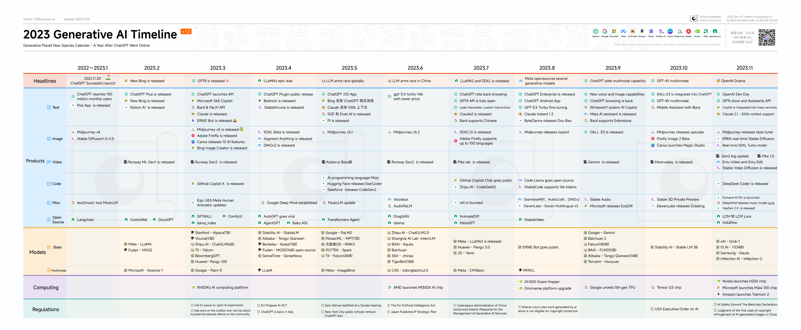

# 2023 Generative AI Timeline 
An image summarizes the timeline of the 2023 generative AI milestones.

On ChatGPT's first anniversary, what is the landscape of generative AI?

[[中文版](https://github.com/kidult00/genai-2023-map/blob/main/zh_version.md)]

This work is licensed under a [Creative Commons Attribution-NonCommercial-ShareAlike 4.0 International License](http://creativecommons.org/licenses/by-nc-sa/4.0/).

