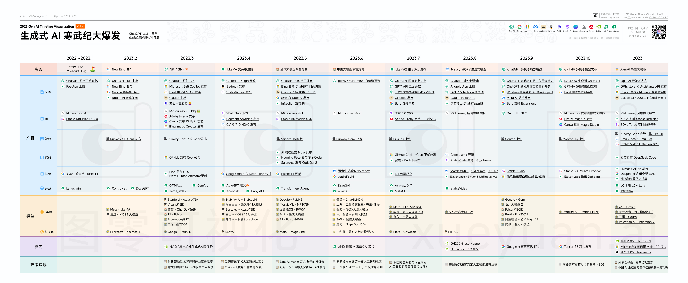

# 2023 生成式 AI 里程碑大事件时间线

2022.11.30，OpenAI 宣布正式推出 ChatGPT。 365 天过去，斗转星移，我们一起见证了生成式 AI 的寒武纪大爆发。

这一年来，国内外的生成式 AI 、大模型和产品以令人眼花缭乱的速度更新迭代，新的创业浪潮风起云涌，大家登记 waitlist 的速度都赶不上产品推陈出新的频率。国内更是开始了百模大战，不少国产大模型陆续宣布性能赶超 GPT3.5。大浪淘沙后，也有不少企业宣告解散，知名大模型项目「套壳」开源项目屡见不鲜。

回顾 ChatGPT 发布的这一年，都有哪些大事件，你会用哪些关键词总结？

[00](https://github.com/kidult00) 整理了2023 年生成式 AI 领域的重大事件时间线，分为头条、产品（文本/图片/视频/代码/开源/其他）、模型、算力、政策五大部分，都集中在一张地图中，方便查阅。

>  注：因个人能力、精力有限，难免挂一漏万，本次绘制的地图只提供一个概览，是一个历史切片，各种疏漏敬请谅解。

[[Englinsh Version](https://github.com/kidult00/genai-2023-map/)]

如何获取大图？

在公众号「设计极客 00」回复：2023，即可获得查看高清大图的链接。

This work is licensed under a [Creative Commons Attribution-NonCommercial-ShareAlike 4.0 International License](http://creativecommons.org/licenses/by-nc-sa/4.0/).

